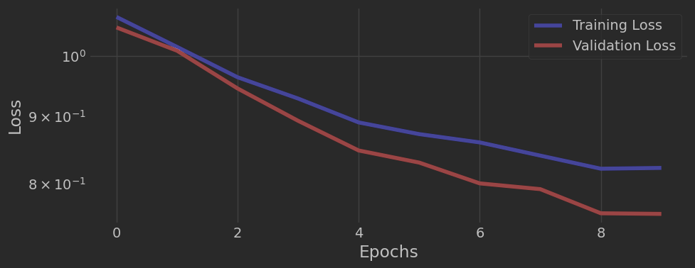
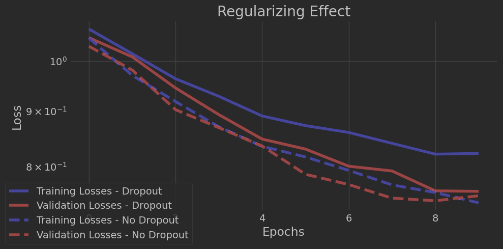

# Model Card

This model was developed as part of an image classification project using a convolutional neural network (CNN). It serves as an educational exercise in building, training, and evaluating a deep learning model with PyTorch.

<!-- TOC -->
* [Model Card](#model-card)
* [Model Details](#model-details)
* [Intended Use](#intended-use)
* [Training Data](#training-data)
* [About Dataset](#about-dataset)
  * [Data Source](#data-source)
  * [Metadata](#metadata)
* [Metrics](#metrics)
* [Ethical Considerations](#ethical-considerations)
* [Caveats and Recommendations](#caveats-and-recommendations)
<!-- TOC -->

# Model Details

The model was developed by Pedro Costa Aragão as an individual study project. The pipeline was implemented in PyTorch and includes: data loading, preprocessing, data augmentation, building a CNN architecture, training, evaluation, and visualization of results.

The objective is to classify images into distinct categories based on features learned from the training data.

The complete code, including the `image_classification.ipynb` notebook, is available in this repository.

# Intended Use

This model is intended for educational purposes only, demonstrating key concepts of computer vision, supervised learning, and convolutional neural networks using a standard image dataset.

# Training Data

The images where downloaded from https://images.cv and are used to train a CNN model. Files can be found [here](https://drive.google.com/drive/folders/1Z5zKMPH9RghYX2y_A_tMFBgqJobVAyPe?usp=sharing).

# About Dataset

## Data Source

The dataset used for this project is a standard benchmark dataset for image classification tasks (e.g., CIFAR-10, consisting of 60,000 32×32 color images in 3 classes).

## Metadata

* **image\_id**: Unique identifier for each image
* **image**: Raw image data (RGB, 32×32 pixels)
* **label**: Category label (cat, dog and hare)

The dataset was split into:

**Training**: 1848 images for each class
**Test**: 208 images for each class

Additionally, the training set may be divided further into training and validation sets.

# Metrics

Model performance is evaluated using standard metrics such as accuracy, loss curves, and confusion matrices.

Example output:

| Metric        | Value                          |
| ------------- |--------------------------------|
| Test Accuracy | \~75%                          |
| Loss          | Decreases steadily over epochs |

Sample plots and visualizations are generated in the notebook.

# Ethical Considerations

This model uses a public dataset designed for benchmarking machine learning algorithms. It does not handle sensitive or personal data. However, the dataset may still contain inherent biases based on the classes and images chosen.

# Caveats and Recommendations

This is a baseline CNN model without extensive hyperparameter tuning or advanced architectures. Future improvements can include:

* Data augmentation strategies
* Deeper or pre-trained networks (e.g., transfer learning)
* Hyperparameter optimization
* Ensemble methods

For production-level tasks, more robust evaluation and testing on diverse datasets are recommended.
